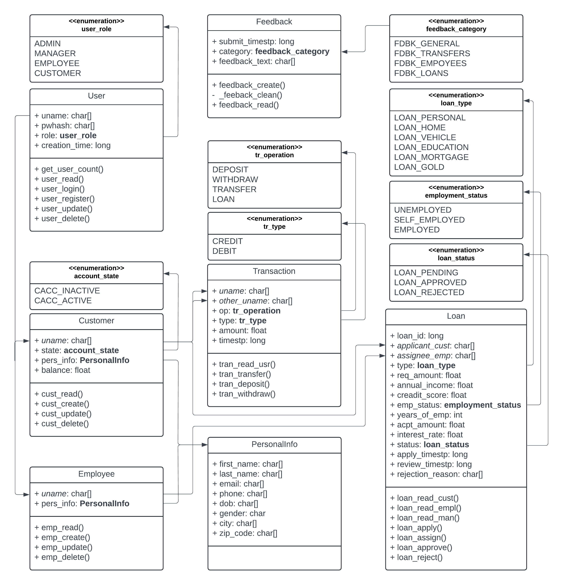

# swsys pre-midterm "mini" project
"bank management system"  
use `./install_packages.sh` to install required C libraries  
use `./run_server.sh` and `./run_client.sh` to run server and client respectively  
uses libbcrypt for password hashing and ncurses for client tui  
please find the up-to-date project repository here: [r3dacted42/bank-mgmt-sys](https://github.com/r3dacted42/bank-mgmt-sys)  

## feature set
the following user phases are supported:  
- admin
    - create user
    - view / modify user
    - delete user
- manager
    - activate / deactivate customer accounts
    - assign loan applications to employees
    - review customer feedback
- employee
    - add new customer
    - modify customer info (needs fixing)
    - review assigned loan applications
    - view customer transactions
- customer
    - view balance
    - deposit money
    - withdraw money
    - transfer money
    - apply for loan
    - view submitted loan applications
    - view transaction history
    - add feedback  

aside from the above, all users can their change password as well

## todo
- delete all user related records on user deletion
- delete all irrelevant records on user role change
- add docstrings for important functions xP

## known issues
- updating customer info from employee phase causes crash

## general flow
- the models store the structure of data used throughout the project
- the controllers directly interact with the database files, using locking to ensure the files are not modified unexpectedly
- the server births a new thread for each incoming connection
- the client must login using credentials which are verified by the worker thread using functions provided by 
the [user controller](./controller/user.h)
- if the same user logs in from a different terminal, the previous thread with for that user account is cancelled
- once authenticated, the server responds with the role of the user
- the client shows the menu corresponding to the role of the logged-in user
- subsequent requests are serviced as they arrive and the response is sent by the worker thread through the socket
- for special kinds of request where the size of the response is not pre-known, the data is buffered into the socket 
the number of objects to be read from the socket is sent in the response under the `bufcount` variable
- the types of requests and their required data can be seen in [Request.h](./model/request.h)
- unions are used in the Request and Response structs to store the required data before being sent

## class diagram

